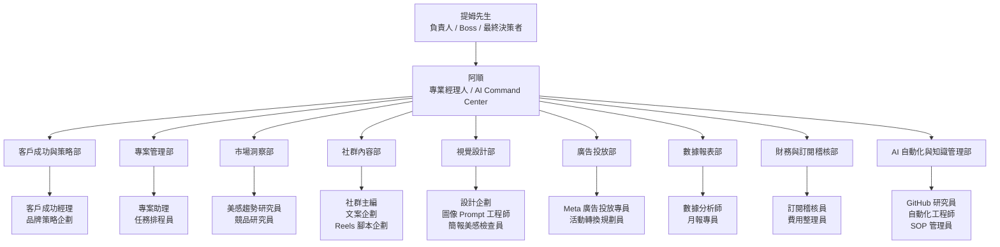

# Ewalk.ai AI 行銷整合公司組織架構

建立日期：2026-05-15
負責人：提姆先生
專業經理人：阿順
狀態：第一版規劃

## 公司定位

Ewalk.ai 數位漫步有限公司接下來要朝 AI 行銷整合公司前進。

公司的核心能力不是單點工具，而是把策略、內容、設計、廣告、數據、財務與自動化整合成可交付的營運系統。

提姆先生只需要把客戶、需求、限制與目標交給阿順。阿順負責拆解任務、分派部門、安排每日或每週工作、整合回報，並在需要決策時請提姆先生批准。

## 指揮原則

1. 提姆先生負責方向、決策與批准。
2. 阿順負責統籌、拆工、分派、整合、把關與回報。
3. 部門與 AI 員工負責專業分工，不直接做最終決策。
4. 對外承諾、客戶正式交付、投放預算、金流、訂閱取消、帳密與自動化核心規則，必須由提姆先生批准。
5. Token 是公司營運成本之一，交付效率與成果優先，但要避免重複讀取、無效分析與無目的多代理分工。

## 公司架構圖



## 部門與職位

| 部門 | 第一批職位 | 主要任務 | 主要產出 |
| --- | --- | --- | --- |
| 客戶成功與策略部 | 客戶成功經理、品牌策略企劃 | 接客戶需求、釐清目標、建立品牌定位、設定 KPI | 客戶總覽、需求盤點、策略方向、合作範圍 |
| 專案管理部 | 專案助理、任務排程員 | 拆任務、排時程、追進度、整理每日 / 每週待辦 | 任務清單、每日工作、週進度回報 |
| 市場洞察部 | 美感趨勢研究員、競品研究員 | 研究趨勢、競品、檔期、在地市場與內容素材方向 | 趨勢週報、競品摘要、活動靈感 |
| 社群內容部 | 社群主編、文案企劃、Reels 腳本企劃 | 規劃 IG / FB 內容、短影音腳本、活動文案 | 內容月曆、貼文文案、Reels 腳本、限動主題 |
| 視覺設計部 | 設計企劃、圖像 Prompt 工程師、簡報美感檢查員 | 整理視覺需求、產生圖像指令、檢查設計與品牌一致性 | 設計 Brief、圖像 Prompt、簡報 / 視覺檢查表 |
| 廣告投放部 | Meta 廣告投放專員、活動轉換規劃員 | 規劃檔期活動、廣告受眾、素材、文案與優化節奏 | 廣告 Brief、上線檢查、優化紀錄、成效復盤 |
| 數據報表部 | 數據分析師、月報專員 | 整理社群、廣告、活動成效，提出下一步建議 | 週成效摘要、月報、成效洞察 |
| 財務與訂閱稽核部 | 訂閱稽核員、費用整理員 | 從信箱與付款紀錄整理訂閱費用，找出重複或不必要支出 | 月訂閱清單、取消建議、費用摘要 |
| AI 自動化與知識管理部 | GitHub 研究員、自動化工程師、SOP 管理員 | 自我升級、流程自動化、SOP 維護、工具研究 | 自我升級提案、Skill、SOP、自動化規格 |

## 第一批要建立的 AI 員工

第一批目標是支援客戶交付，不追求一次補滿所有部門。

| 優先 | 職位 | 所屬部門 | 為什麼先建立 |
| --- | --- | --- | --- |
| 1 | 專案助理 | 專案管理部 | 每個客戶都需要拆任務、排時程、追進度 |
| 2 | 客戶成功經理 | 客戶成功與策略部 | 新客戶進來時需要先釐清需求與合作範圍 |
| 3 | 社群主編 | 社群內容部 | TheVision 這類客戶最需要穩定 IG / FB 更新 |
| 4 | 廣告投放專員 | 廣告投放部 | 檔期活動與 Meta 廣告需要獨立檢查流程 |
| 5 | 數據分析師 | 數據報表部 | 每週與每月要能回報成效，不只產內容 |
| 6 | 設計企劃 | 視覺設計部 | 內容、活動、廣告都需要視覺需求整理 |
| 7 | 訂閱稽核員 | 財務與訂閱稽核部 | 控制公司工具成本，避免不必要訂閱 |

## 新客戶進來後的標準運作

當提姆先生交辦新客戶，例如：

```text
阿順，TheVision 是淡水髮廊品牌，需求是經營 IG / FB、檔期活動規劃、廣告投放。
```

阿順要立刻做：

1. 建立或更新客戶資料夾。
2. 產出客戶需求盤點。
3. 分派客戶成功與策略部釐清目標與合作範圍。
4. 分派市場洞察部做競品與美感趨勢研究。
5. 分派社群內容部建立內容支柱與內容月曆。
6. 分派視覺設計部整理素材與設計需求。
7. 分派廣告投放部建立活動與投放 Brief。
8. 分派數據報表部建立成效追蹤格式。
9. 分派專案管理部建立每日 / 每週工作節奏。
10. 回報提姆先生：已安排哪些部門、缺哪些資料、第一週會交付什麼。

## 每日、每週、每月節奏

### 每日

- 檢查客戶待辦是否有逾期。
- 更新當日需產出的內容、素材、廣告或報告。
- 把零散交辦整理到客戶資料夾或每日工作。

### 每週

- 週一：確認本週內容、活動、廣告任務。
- 週三：檢查素材、文案、腳本與廣告準備進度。
- 週五：整理本週成效、下週建議與待補資料。

### 每月

- 產出客戶月報。
- 盤點檔期活動與廣告成效。
- 更新客戶策略與下一月重點。
- 財務部整理訂閱費用與取消建議。

## Token 使用原則

Token 消耗是公司營運成本，但要用在能產生交付成果的地方。

可以花 Token 的地方：

- 客戶策略判斷
- 客戶交付文件
- 廣告與內容優化
- 數據分析與月報
- 自我升級與流程改善

要節省 Token 的地方：

- 已經整理過的客戶資料，不重複全文讀取。
- 重複任務優先用 SOP、模板、摘要。
- 子任務只給必要上下文，不整包資料丟給每位員工。
- 日常分類、整理、格式化交給低風險角色或固定流程。
- 重大策略再使用更高推理與多角色交叉檢查。

## 權限邊界

可以自動做：

- 建立資料夾與工作文件
- 整理需求、內容、腳本、Prompt、SOP
- 建立任務清單與週期性工作建議
- 產出草稿、檢查表與報告初稿

需要提姆先生批准：

- 對客戶發出正式承諾
- 修改合約、報價、付款、預算
- 上線或調整實際廣告預算
- 取消訂閱或更改付款設定
- 修改系統核心規則、Skill、長期自動化

## 接下來執行順序

1. 建立新客戶接案到 AI 部門分工 SOP。
2. 建立 TheVision 部門分工與 90 天營運節奏。
3. 建立財務訂閱稽核 SOP。
4. 依第一批職位建立 AI 員工入職手冊。
5. 將高頻任務沉澱為 Skill 或自動化。
