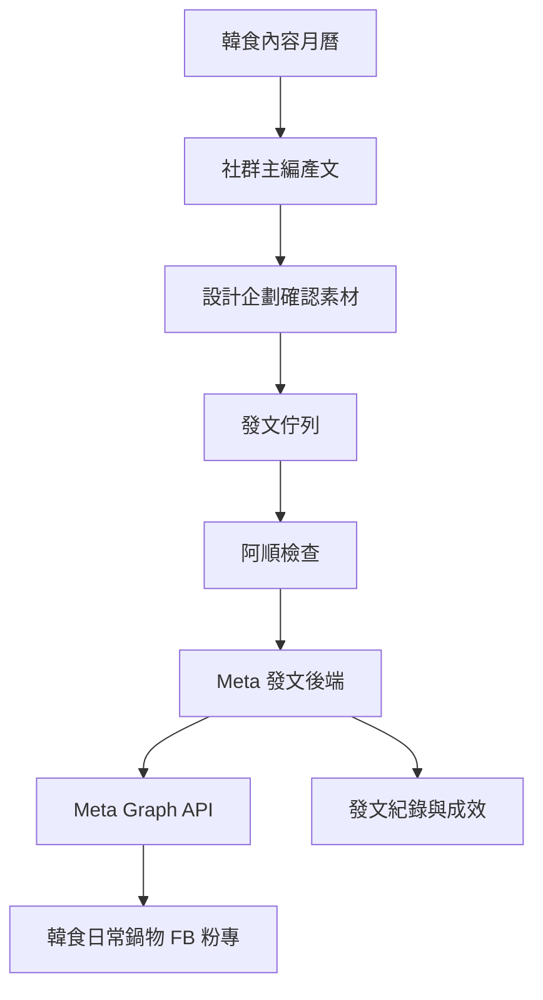

# 韓食日常鍋物 Meta 粉專全自動發文系統規劃

建立日期：2026-05-15
客戶：韓食日常鍋物
狀態：第一則 FB 測試貼文已成功發布
負責：阿順
最終決策者：提姆先生

## 為什麼選韓食日常鍋物做樣板

韓食日常鍋物的 FB 粉專由 Ewalk.ai 公司創立，因此比較適合作為第一個 Meta 自動發文樣板。

優勢：

- 粉專權限比較容易確認
- 品牌資料已在 Ewalk.ai Brain 內
- 已有菜單、品牌規範、素材與內容需求稿
- 餐飲內容適合建立固定貼文模板
- 自動發文風險比外部客戶既有帳號低

## 目標

建立一套能從 Obsidian 內容月曆，自動串接 Meta Graph API 發布 FB 粉專貼文的流程。

第一階段先完成 FB 粉專：

- Meta 開發者帳號與 App 串接
- Page access token 安全管理
- 測試發文
- 發文紀錄回寫
- 失敗通知

已知 Meta 資產：

- 粉專正式名稱：韓食日常鍋物
- 粉專連結：`https://www.facebook.com/profile.php?id=61589429556499`
- Page ID：`1082884688247950`（Meta Business 後台確認）
- 粉專管理員：Ewalk數位漫步
- Business Portfolio：walk數位漫步
- 已建立第一支 Meta App：`Ewalk 韓食日常鍋物自動發文`
- 第一支 Meta App ID：`1005467575376013`
- 第一支 Meta App 類型：企業商家
- 第一支 Meta App 判斷：可作為第一版 FB 粉專自動發文驗證使用
- 權限檢查重點：`pages_manage_posts`、`pages_read_engagement`、`pages_show_list` 位於下方「需存取權驗證」表格，不是上方搜尋區
- Graph API Explorer 已準備：App 已選定、測試路徑為 `me/accounts?fields=id,name`、權限已加入 `pages_show_list`、`pages_read_engagement`、`pages_manage_posts`
- Graph API Explorer 初測：API 可正常回應，但 `me/accounts` 尚未回傳 `韓食日常鍋物`
- Business Suite 確認：提姆先生對 `韓食日常鍋物` 有完整控制權，App 也在 `walk數位漫步` Business 內
- 補 `business_management` 後複測：`me/accounts?fields=id,name&limit=100` 已成功回傳 `韓食日常鍋物`，Page ID 對上 `1082884688247950`
- 初步判斷：`business_management` 是 Business Portfolio 粉專被列出的關鍵權限
- 是否同步 IG：要，但因 IG 簡訊驗證暫緩，放第二階段
- 本機發文工具：已建立 `腳本/meta-facebook`，預設 dry-run，正式發文需提姆先生批准
- Page access token 驗證：2026-05-16 已由本機 `.env.local` 安全讀取，`check-page.mjs` 可讀到粉專 `韓食日常鍋物`
- 第一則測試貼文：2026-05-16 已成功發布，Meta Post ID：`1082884688247950_122101992453314318`

第二階段再做：

- 每週內容表自動排程
- 發文後成效回收
- 每週內容表現摘要

第三階段才做：

- 固定規則內全自動產文、產圖、排程、發布

## 韓食日常鍋物適合自動化的內容

### 可以全自動或半自動

- 菜色介紹
- 餐點特色
- 湯底介紹
- 營業時間提醒
- 店內氛圍
- 顧客評論整理
- 節氣或天氣型貼文

### 需要提姆先生批准

- 優惠活動
- 價格資訊
- 限時檔期
- 合作邀約
- 品牌聲明
- 負評或客訴回應
- 廣告投放與加強推廣

## 第一版系統架構



## 發文資料格式

建議新增 `02_活動與內容/Meta自動發文佇列.md` 管理。

```md
## 任務 ID

## 發布時間

## 平台

## 貼文類型

## 文案

## 素材

## CTA

## 狀態

## 審核

## Meta Post ID

## 成效回收
```

## 第一批貼文模板

### 菜色介紹

目的：

- 介紹主力菜色
- 建立品牌食慾感
- 引導到店或私訊

格式：

```text
今天想吃一鍋有熱度的韓式日常嗎？

{{菜色名稱}} 用 {{特色食材}} 搭配 {{湯底/醬料特色}}，
適合 {{情境}} 的時候慢慢吃。

{{CTA}}
```

### 天氣型貼文

目的：

- 連動天氣與鍋物需求

格式：

```text
今天這種天氣，很適合來一鍋熱的。

{{主推餐點}} 的湯頭是 {{特色}}，
吃起來舒服，也很有飽足感。

晚餐想簡單吃好一點，可以來韓食日常鍋物。
```

### 固定營業提醒

目的：

- 穩定粉專更新
- 提醒營業資訊

格式：

```text
韓食日常鍋物今日正常營業。

想吃韓式鍋物、熱湯、主食與小菜，
今天可以安排一餐熱呼呼的日常。
```

## 需要補齊資料

- [x] FB 粉專完整連結：`https://www.facebook.com/profile.php?id=61589429556499`
- [x] Meta Business Portfolio 名稱：walk數位漫步
- [x] 第一支 Meta App 名稱：`Ewalk 韓食日常鍋物自動發文`
- [x] Page ID：`1082884688247950`（Meta Business 後台確認）
- [ ] 發文用後端部署位置
- [x] 發文紀錄存放位置：`02_活動與內容/Meta自動發文佇列.md`
- [x] 第一階段測試粉專或測試貼文規則
- [x] 是否同時串接 IG：要
- [ ] IG 帳號連結
- [ ] IG 是否為專業 / 商業帳號
- [ ] IG 是否已連結韓食日常鍋物 FB 粉專

## 第一階段上線條件

- [x] 第一支 Meta App 已建立
- [x] 第一支 Meta App 權限檢查完成
- [x] Pages API 必要權限可在第一支 Meta App 看到
- [x] Graph API Explorer 測試路徑與權限已準備
- [x] 粉專權限確認：Business Suite 顯示提姆先生有完整控制權
- [x] `me/accounts` 可看到韓食日常鍋物
- [x] 補 `business_management` 後重新授權測試
- [x] 可取得 Page access token
- [x] Page access token 已完成本機安全讀取測試
- [x] 本機發文工具已建立
- [x] 測試貼文 dry-run 通過
- [x] 測試貼文成功發布
- [x] 發文紀錄可回寫
- [ ] 失敗通知可發給阿順
- [ ] 提姆先生批准進入自動排程

## 關聯 SOP

- [[../../13_SOP流程/Meta粉專全自動發文串接SOP|Meta粉專全自動發文串接SOP]]
- [[../../08_自動化/營運Flows/Meta粉專全自動發文Flow|Meta粉專全自動發文Flow]]
