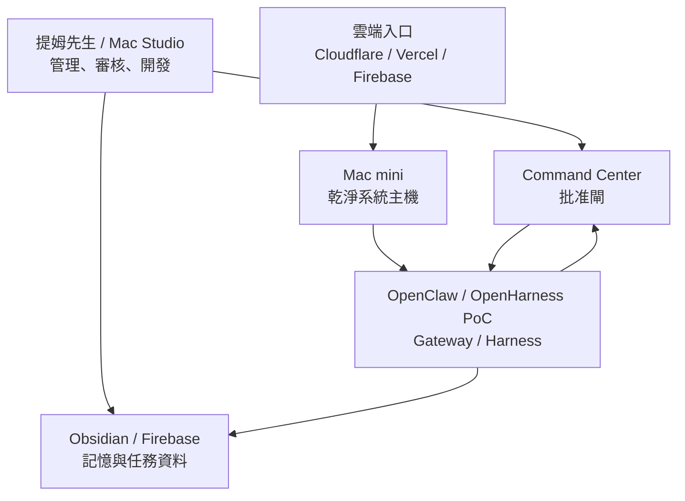

# Agent Harness 主機安全評估

建立日期：2026-06-02  
負責角色：阿順  
最終決策者：提姆先生  
狀態：第一版評估，尚未採購或重置任何設備

## 結論

不建議把提姆先生目前這台 Mac Studio 直接變成長期系統主機。

建議做法：

```text
目前 Mac Studio：開發 / 管理 / 測試 / 人工審核
新買 Mac mini：乾淨、隔離、專門跑 Ewalk.ai Harness / Gateway / 自動化
雲端服務：只放需要外網穩定存取的 API / Webhook / Command Center
```

## 目前這台電腦狀態

本機檢查結果：

| 項目 | 狀態 | 判斷 |
| --- | --- | --- |
| 機型 | Mac Studio | 性能夠用 |
| 晶片 | Apple M1 Max | 可跑多數本地自動化與開發任務 |
| 記憶體 | 32GB | 足夠做開發、測試、瀏覽器自動化與中小型本地模型 |
| 系統 | macOS 26.2 | 新系統，適合開發 |
| 資料磁碟 | 約 97% 使用，剩約 13GB | 不適合當長期主機，空間風險高 |
| 外接資料碟 | 約 9TB，已使用約 6.9TB | 高機率有大量客戶與個人資料 |
| 防火牆 | 關閉 | 不適合直接對外服務 |
| Time Machine | 自動備份開啟 | 好事，但仍需確認備份目的地與加密 |
| FileVault | 本次命令無法正常讀取狀態 | 需人工到系統設定二次確認 |

## 為什麼不建議把目前這台當主機

### 1. 隱私資料太多

這台很像提姆先生的主要工作機，可能包含：

- Chrome 登入狀態
- Gmail / Google Drive / Meta / Firebase / Apple ID session
- Keychain / 密碼 / token
- 客戶資料
- 公司與私人檔案
- 外接接案資料碟

如果把它拿來跑 OpenClaw / OpenHarness / Gateway 類系統，最大風險不是 CPU 不夠，而是工具權限不小心碰到私人資料。

### 2. 防火牆目前關閉

若未來要讓外部裝置、手機、Discord webhook、Web UI 進來，這台不應該在防火牆關閉狀態下承擔服務角色。

### 3. 空間不足

資料磁碟剩約 13GB，長期跑：

- agent logs
- browser automation cache
- Docker / node_modules
- local model
- screenshots
- trace / output

很容易爆掉。

### 4. 角色混雜

工作機最好是「人用」；系統主機最好是「機器用」。

混在一起會讓：

- 錯誤排查變難
- 權限管理變難
- 備份策略變難
- 出問題時不敢重啟或重置

## 是否需要重置目前這台

不建議現在重置。

原因：

- 這台有大量工作資料與現有環境。
- 重置成本高，容易影響日常工作。
- 即使重置後，也會被你拿來工作，最後又變成資料混雜。

比較好的做法：

1. 這台保留為開發 / 管理 / 審核主機。
2. 清出磁碟空間到至少 80GB 以上。
3. 開啟防火牆。
4. 確認 FileVault。
5. 所有高風險 agent 工具只在專用資料夾與測試環境運行。

## 是否建議買 Mac mini

建議買一台專用 Mac mini，若 Ewalk.ai 要認真做 Harness / Gateway。

### 最推薦規格

| 用途 | 建議規格 |
| --- | --- |
| 最小可行主機 | M4 / 24GB RAM / 512GB SSD |
| 較穩定長期使用 | M4 / 24GB RAM / 1TB SSD / 10Gb Ethernet |
| 會跑較多瀏覽器自動化或本地模型 | M4 Pro / 48GB RAM / 1TB SSD |

阿順建議：

```text
M4 / 24GB / 1TB / 10Gb Ethernet
```

這個規格對 Ewalk.ai Harness 最均衡，不會過度花錢，也不會太快不夠用。

若未來真的要跑大量本地模型、影像生成、影片處理，再考慮 M4 Pro / 48GB。

## 新 Mac mini 要怎麼設定才安全

### 帳號與資料隔離

- 不用提姆先生私人 Apple ID 登入。
- 建立專用本機管理員：`ewalk-admin`
- 建立專用執行帳號：`ewalk-runner`
- 不同步個人 iCloud、照片、訊息、瀏覽紀錄。
- 不掛載私人接案碟。

### 系統安全

- 開啟 FileVault。
- 開啟防火牆。
- 開啟自動更新。
- 關閉不必要的遠端登入。
- 只允許必要 port。
- 使用獨立密碼與密碼管理器。

### Agent 安全

- 所有 agent 只能讀寫指定資料夾：
  - `/Users/ewalk-runner/Ewalk.ai-system`
  - `/Users/ewalk-runner/Ewalk.ai-logs`
- 不讓 agent 讀整台電腦。
- 不把 token 寫進 Obsidian。
- 高風險工具預設關閉：
  - Meta 發文
  - 廣告預算
  - 金流
  - 訂閱取消
  - 刪除資料

### 網路安全

- 對外服務優先透過 Cloudflare Tunnel / Tailscale / VPN。
- 不建議直接開 router port forwarding。
- Webhook 先進雲端，再轉本機。
- OpenClaw / OpenHarness PoC 先只允許內網或 VPN。

## 最安全架構



## 阿順建議執行順序

### 本週

1. 不重置目前 Mac Studio。
2. 先清磁碟空間，至少保留 80GB。
3. 開啟防火牆。
4. 人工確認 FileVault。
5. 建立 `Agent Harness 主機安全評估` 作為決策文件。

### 買 Mac mini 後

1. 全新安裝，不登入私人 Apple ID。
2. 建立 `ewalk-runner`。
3. 開啟 FileVault、防火牆、自動更新。
4. 只放 Ewalk.ai Harness 所需資料。
5. 先跑 `ai_runs` dry-run。
6. 再跑 OpenHarness / OpenClaw PoC。

### 等 PoC 穩定後

1. 才接 Discord / Web UI。
2. 才接 Langfuse 觀測。
3. 才接 n8n / Dify。
4. Meta 發文、廣告、金流仍維持人工批准。

## 最終建議

如果只是「試玩」：目前 Mac Studio 可以。

如果要做「Ewalk.ai 系統主機」：買一台乾淨 Mac mini 最安全。

如果要做「正式對外服務」：Mac mini + 雲端入口，不要讓私人工作機直接對外。

## 參考來源

- Apple Mac mini 技術規格：https://www.apple.com/mac-mini/specs/
- Apple Platform Security：Secure Enclave：https://support.apple.com/en-mide/guide/security/sec59b0b31ff/web
- Apple Platform Security：FileVault：https://support.apple.com/en-asia/guide/security/sec4c6dc1b6e/web
