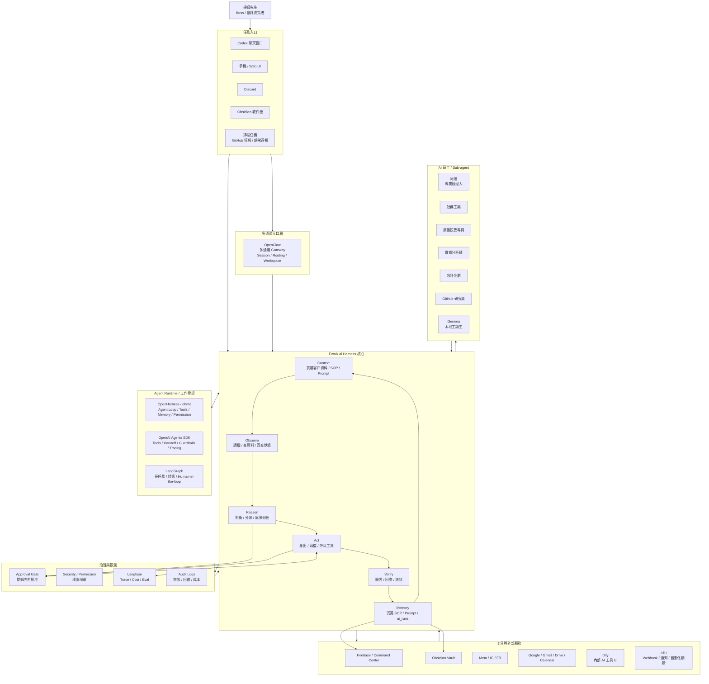

# Agent Harness 架構圖

建立日期：2026-06-02  
負責角色：阿順  
最終決策者：提姆先生  
用途：用一張圖理解 Ewalk.ai、阿順、OpenHarness、OpenClaw、OpenAI Agents SDK、LangGraph、Langfuse、Dify / n8n 的關係

## 一眼看懂版



## 各工具站位

| 名稱 | 在圖中的位置 | 白話定位 |
| --- | --- | --- |
| Ewalk.ai Harness | 中央核心 | 公司自己的 AI 工作制度 |
| 阿順 | AI 員工 / 總控 | 負責判斷、分派、整合、回報 |
| OpenHarness / ohmo | Agent Runtime | 值得研究的 agent 工作骨架 |
| OpenClaw | Gateway | 多通道入口，讓阿順接 Discord / Web / 手機 |
| OpenAI Agents SDK | Agent Runtime | 核心任務 loop、工具、handoff、guardrails |
| LangGraph | Agent Runtime | 長任務、狀態保存、人審、恢復 |
| Langfuse | Governance | trace、成本、錯誤回放、評估 |
| Dify | Tools | 把固定 AI 工具做成 UI |
| n8n | Tools | Gmail、RSS、Discord、Webhook 自動化橋接 |
| Firebase Command Center | Tools / Memory | 任務、客戶、批准、執行紀錄資料庫 |
| Obsidian | Memory | 公司知識庫、SOP、Prompt、客戶資料 |

## 阿順判斷

Ewalk.ai 不應該把公司核心交給單一外部 Harness。

最穩做法是：

```text
Ewalk.ai 自家 Harness 規則
  + OpenHarness 研究 agent 工作骨架
  + OpenClaw 研究多通道入口
  + OpenAI Agents SDK 做核心 agent loop
  + LangGraph 做長任務與人審
  + Langfuse 做觀測與成本
  + Dify / n8n 做業務橋接
```

## 對照 NVIDIA Agent Toolkit

提姆先生提到的 NVIDIA 架構可以這樣理解：

| NVIDIA 圖中概念 | 白話 | Ewalk.ai 對應 |
| --- | --- | --- |
| OpenClaw | 開源 agent 協同框架 / agent 工作平台 | OpenClaw 作為多通道 Gateway PoC 候選 |
| OpenShell | 安全 runtime / sandbox / policy 執行環境 | Ewalk.ai 目前缺的安全 runtime 參考，短期先由權限表、批准閘、Mac Studio 隔離主機補上 |
| NemoClaw | NVIDIA 把 OpenClaw、OpenShell、Nemotron、Agent Toolkit 包成企業級 stack | Ewalk.ai Agent Harness 的企業版參考模型 |
| NVIDIA Agent Toolkit | 串接、觀測、優化、跨 framework agent 工具集 | OpenAI Agents SDK / LangGraph / Langfuse / Dify / n8n 的組合 |
| Nemotron / CUDA-X | 模型與加速庫 | Ewalk.ai 暫以 OpenAI / Gemini / Claude API 為主，不先追本地 GPU stack |

所以在 Ewalk.ai 規劃裡：

```text
我們的協同框架 = Ewalk.ai Agent Harness
我們的操作台 = Ewalk.ai Command Center
我們的安全 runtime 目標 = 權限隔離 + Approval Gate + 未來評估 OpenShell / NemoClaw
我們的核心 agent loop = OpenAI Agents SDK + LangGraph
我們的記憶與狀態 = Firebase + Obsidian
我們的觀測 = Langfuse + ai_runs
```

一句話：

```text
NVIDIA 的 OpenShell / NemoClaw 是企業級安全外殼參考。
Ewalk.ai 的協同框架是自家 Agent Harness，不是直接把公司交給某個外部框架。
```

## 下一步

1. 先建立 `ai_runs` dry-run，讓每次阿順任務都有紀錄。
2. 在 Command Center 加上「AI 執行紀錄」區塊。
3. 建立工具權限表，確認每個工具能做什麼、不能做什麼。
4. 再選 OpenHarness 或 OpenClaw 做低風險 PoC。
