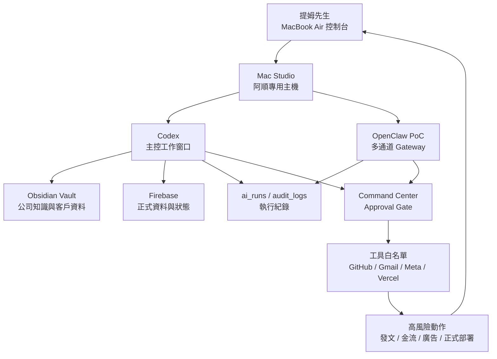

# Mac Studio 阿順專用主機完全體升級計畫

建立日期：2026-06-04
負責角色：阿順
最終決策者：提姆先生
狀態：第一版規劃，尚未開始安裝 OpenClaw / OpenShell 類工具

## 提姆先生的決策

提姆先生已確認：Mac Studio 完全給阿順作為專用主機使用。

筆電不是阿順主機。筆電是提姆先生的控制台，用來和阿順溝通、審核、外出急件處理；阿順的主要執行、長任務、排程、自動化與工具環境集中在 Mac Studio。

## 目前主機盤點

| 項目 | 現況 |
| --- | --- |
| 機型 | Mac Studio |
| 年份 | 2022 |
| 晶片 | Apple M1 Max |
| 記憶體 | 32GB |
| macOS | 26.2 |
| 主機定位 | 阿順專用主機 |
| 內建資料碟可用空間 | 約 62GB |
| Ewalk.ai Vault 大小 | 約 4.8GB |
| 已掛載大型磁碟 | `/Volumes/提姆接案碟` |
| 大型磁碟容量 | 約 9.1TB，剩約 2.3TB |

## 核心結論

Mac Studio 可以當阿順 24H 工作主機。提姆先生已明確傾向 OpenClaw First：OpenClaw 作為主要自主運行框架，Codex 作為工程、文件、程式修改與精準交付的專業員工。

正確做法是：

```text
Mac Studio 固定主機
  + Ewalk.ai Agent Harness 治理層
  + OpenClaw 主要自主 Runtime
  + Codex 工程與文件專業員工
  + Command Center 批准中心
  + ai_runs / audit_logs 執行紀錄
  + Firebase / Obsidian 記憶與狀態
  + 高風險動作 Approval Gate
```

這樣阿順可以長時間工作、自己整理資料、產草稿、跑研究、更新名冊、做月報，但遇到發文、金流、廣告、正式部署、核心規則與高權限 token，仍回到提姆先生批准。

## 角色分工

| 元件 | 角色 |
| --- | --- |
| Mac Studio | 阿順固定執行主機 |
| MacBook Air | 提姆先生控制台 |
| Codex | 阿順主要工程與文件工作窗口 |
| OpenClaw | 候選多通道 Gateway / 常駐 agent runtime，不直接接高風險權限 |
| OpenShell | 企業級 sandbox / policy 參考，目前先研究與低風險 PoC |
| NemoClaw | NVIDIA 企業 stack 參考，不列第一階段正式導入 |
| Command Center | 提姆先生審核、批准、看任務狀態 |
| Firebase | 正式資料庫、任務狀態、審核佇列 |
| Obsidian Vault | 公司知識、SOP、客戶資料源頭 |
| ai_runs | 每次 AI 任務的執行紀錄 |

## 為什麼不能直接整台無限制交給 agent

OpenClaw 這類工具的價值是「讓 agent 常駐、接工具、接通道、可以動作」。但也因為它能動作，所以不能一開始就給完整主機、完整帳號、完整金流與完整社群發布權限。

風險包含：

- 外部訊息誤觸 shell / 部署 / 發文。
- token 或客戶資料被錯誤讀取或傳出。
- 長任務重複執行，造成重複發文、重複部署或資料覆蓋。
- AI 自己修改規則後越權。
- 發生錯誤時無法回查是哪個工具、哪個通道、哪個任務造成。

所以第一原則是：

```text
常駐可以
自動化可以
低風險可以自己跑
高風險一定要有批准閘與紀錄
```

## 升級架構



## 分階段施工

### Phase 0：主機固定化

目標：先把 Mac Studio 變成穩定可長跑的工作機。

要做：

- 確認主機不睡眠。
- 開啟自動重啟。
- 建立清楚的工作資料夾。
- 確認公司 Google 帳號是阿順主機身份。
- 設定遠端連線方式，讓提姆先生用筆電連回來。
- 建立每日狀態檢查。
- 建立備份策略。

驗收：

- Mac Studio 連續開機 24 小時不中斷。
- 提姆先生筆電可連回 Mac Studio。
- Codex 能讀寫 Ewalk.ai Vault。
- Command Center 能開啟。

### Phase 1：權限與紀錄治理

目標：讓阿順能多做事，但所有動作可追蹤。

要做：

- 更新工具權限表。
- 更新 Approval Gate。
- 每次任務寫入 `ai_runs` 或本機 dry-run。
- 每日輸出摘要。
- 將高風險任務集中進 Approval Queue。

驗收：

- 低風險任務可自動完成。
- 高風險任務會停下等待批准。
- Command Center 可看到任務狀態。

### Phase 2：OpenClaw 低風險 PoC

目標：研究 OpenClaw 是否適合當阿順多通道外骨架。

允許範圍：

- 只接測試 workspace。
- 只允許讀寫測試收件匣。
- 只允許產生草稿與任務紀錄。
- 不接 Meta 正式發文。
- 不接金流。
- 不接廣告預算。
- 不接正式部署。
- 不接完整 shell 權限。

驗收：

- 可以從指定通道送任務。
- 可以建立任務紀錄。
- 可以拒絕高風險指令。
- 可以把需要批准的事項送進 Command Center。

### Phase 3：長任務與排程

目標：讓阿順開始承接 24H 工作，但先從低風險任務開始。

第一批任務：

- 每日 GitHub 自我升級情報收集。
- 每週美感趨勢資料收集。
- 客戶名冊缺資料盤點。
- Gmail 訂閱付費摘要草稿。
- Command Center 每日狀態摘要。

驗收：

- 任務會自動開始。
- 任務會留下紀錄。
- 任務失敗會回報。
- 不會自己做高風險外部動作。

### Phase 4：半自動客戶營運

目標：阿順能負責客戶資料整理、內容草稿、月報草稿與工作分派。

可自動：

- 客戶資料盤點。
- 社群文案草稿。
- 廣告建議草稿。
- 月報草稿。
- 素材缺口清單。
- 內部交辦。

需批准：

- 對外發文。
- 對客戶正式回覆。
- 廣告預算調整。
- 網站正式部署。

### Phase 5：更高級安全 runtime 研究

目標：研究 OpenShell / NemoClaw 類 enterprise runtime 是否值得導入。

短期只研究：

- sandbox / policy 設計。
- agent 隔離方式。
- 工具權限白名單。
- 長任務恢復。
- audit trail。

不做：

- 不把 OpenShell 當正式生產環境。
- 不一次導入 NemoClaw。
- 不為了追工具重寫現有 Ewalk.ai 系統。

## 主機安全規則

### 阿順可自動做

- 讀寫 Ewalk.ai Brain 內部文件。
- 建立 SOP、草稿、任務紀錄。
- 建立客戶待補資料清單。
- 更新本機 Command Center 預覽。
- 研究 GitHub / 官方文件並整理成報告。
- 產出內部建議。

### 需提姆先生批准

- 對外發文。
- 發正式 Email / DM。
- 改廣告預算。
- 取消或改訂閱。
- 改付款方式。
- 部署正式網站。
- 寫入正式 Firestore 高風險 collection。
- 新增高權限 API token。
- 修改核心規則、AGENTS、Skills。
- 刪除大量資料或不可逆操作。

## 第一批要補的東西

| 項目 | 原因 |
| --- | --- |
| 遠端連線 | 讓提姆先生用筆電控制 Mac Studio |
| 備份策略 | 內建 SSD 剩約 62GB，不能沒有備份 |
| 外接 SSD / NAS 策略 | 大型素材不能堆內建碟 |
| OpenClaw 測試 workspace | 避免一開始碰正式資料 |
| LaunchAgent / 排程策略 | 讓任務能長時間運作 |
| 主機狀態日報 | 讓提姆先生知道阿順有沒有正常工作 |

## 阿順建議

接下來不要急著安裝 OpenClaw 進正式資料。

正確順序是：

1. 先把 Mac Studio 固定化。
2. 設好遠端連線。
3. 設好備份。
4. 設好工具權限與執行紀錄。
5. 再做 OpenClaw 低風險 PoC。
6. PoC 穩定後，才讓它接到 Ewalk.ai 的收件匣與 Command Center。

這樣我們會得到的是「可靠的阿順主機」，不是一台失控的自動化電腦。

## 參考來源

- OpenClaw GitHub：`https://github.com/openclaw/openclaw`
- NVIDIA OpenShell Blog：`https://blogs.nvidia.com/blog/secure-autonomous-ai-agents-openshell/`
- NVIDIA Agent Toolkit Newsroom：`https://nvidianews.nvidia.com/news/enterprise-software-leaders-build-ai-agents-with-nvidia`
