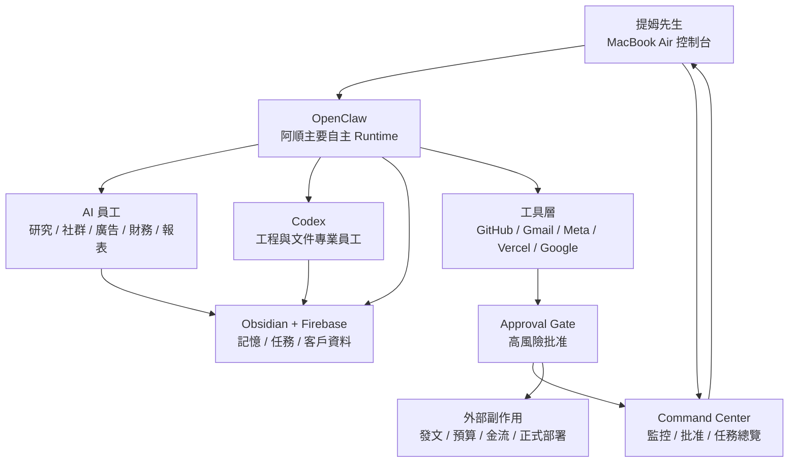

# OpenClaw First 阿順主機架構

建立日期：2026-06-04
負責角色：阿順
最終決策者：提姆先生
狀態：架構調整，準備進入安裝與 PoC

## 提姆先生的判斷

提姆先生認為：如果 Codex 的沙盒架構讓工作程序無法足夠自主運行，Ewalk.ai 應傾向把主要工作架構放在 OpenClaw 上。

阿順接受此方向。

新的定位：

```text
OpenClaw = 阿順主機的主要自主運行框架
Codex = 工程、文件、程式修改與精準交付的專業工作員工
Command Center = 提姆先生監控、批准與治理中心
Mac Studio = 阿順專用主機
MacBook Air = 提姆先生溝通與審核入口
```

## 為什麼改成 OpenClaw First

Codex 的優點：

- 讀寫程式與文件精準。
- 對 repo / workspace 的修改能力強。
- 沙盒與權限較嚴謹，適合交付工程與文件。

Codex 的限制：

- 不適合直接當 24H 自主調度中樞。
- 沙盒與權限流程較保守，長期自動運行彈性不足。
- 比較像高品質專業員工，不像整間公司的常駐協同框架。

OpenClaw 的適合處：

- 較適合作為常駐 agent runtime。
- 適合多通道入口與 session 管理。
- 適合把 Discord / Web / 手機 / CLI / 工具 / Skills 接成工作系統。
- 更接近提姆先生想要的「阿順主機 24H 自主接管」。

## 新架構



## 各元件定位

| 元件 | 新定位 |
| --- | --- |
| OpenClaw | 阿順主機自主運行中樞，負責收任務、分派、長時間跑、回報 |
| Codex | 被 OpenClaw / 阿順交辦的工程員工，負責程式、文件、資料結構與驗證 |
| Command Center | 提姆先生看的監控與批准面板 |
| Firebase | 正式任務狀態、客戶資料、批准佇列、audit log |
| Obsidian Vault | 公司知識庫、SOP、草稿、客戶資料源頭 |
| ai_runs | 所有 AI 任務紀錄 |
| Approval Gate | 阻擋高風險動作 |

## 智慧來源與模型路由

OpenClaw 本身是 agent runtime / 調度框架，不是智慧本體。

智慧來源要接模型：

```text
OpenClaw 負責收任務、分派、調工具、記錄、回報
本地 AI 負責低成本、低風險、可大量跑的小任務
雲端 AI 負責高推理、高品質、高價值任務
Codex 負責工程、文件、程式碼與系統修改
```

### Ewalk.ai 模型分工

| 模型 / 工具 | 角色 | 適合任務 | 不適合任務 |
| --- | --- | --- | --- |
| Ollama 本地模型 | 低成本內勤員 | 分類、摘要、初步整理、缺資料掃描、檔名整理、簡單日報草稿 | 複雜策略、正式交付、程式修復、高品質文案 |
| Gemma / 本地小模型 | 隱私型整理員 | 本機資料預整理、客戶資料初步標籤、簡單格式化 | 高難推理、品牌語氣判斷、重要決策 |
| Codex | 工程與文件專業員工 | 改程式、建 SOP、修 Command Center、產生資料結構、驗證工作流 | 24H 總調度、日常前台交辦 |
| OpenAI / GPT 系列 | 高推理決策員 | 複雜策略、客戶提案、難題分析、重要文案、跨資料整合 | 大量低價值重複整理 |
| Gemini | Google 生態與長資料輔助 | Google 文件、長內容整理、NotebookLM / Drive 相關流程 | 需要嚴格程式修改的任務 |
| Claude / Claude Code | 備援工程與長文推理 | 長文重構、工程備援、不同模型交叉檢查 | 成本不明或已取消訂閱時不作主力 |

### 路由原則

任務進來後，OpenClaw 先做四個判斷：

1. **風險**：會不會對外、動錢、動預算、動核心系統。
2. **難度**：需不需要高推理、程式能力或品牌判斷。
3. **隱私**：是否含客戶敏感資料、帳務、內部資料。
4. **成本**：能不能用本地 AI 先處理，避免浪費雲端 token。

路由規則：

```text
低風險 + 低難度 + 大量重複 = Ollama / 本地 AI
低風險 + 需要寫檔 / 改系統 = Codex
中高難度 + 需要策略品質 = OpenAI / GPT
Google 生態長資料 = Gemini
高風險 = 不直接執行，送 Command Center Approval Queue
```

### 實際例子

| 任務 | 先派誰 | 需要時升級給誰 |
| --- | --- | --- |
| 掃客戶資料夾缺哪些欄位 | Ollama / 本地 AI | Codex 整理成正式名冊 |
| 每日主機狀態摘要 | 本地 AI | Codex 修資料格式 |
| 社群貼文初稿 | 本地 AI | GPT 潤色品牌語氣 |
| 廣告策略建議 | GPT | Codex 寫入報表或 Command Center |
| Command Center UI 修改 | Codex | GPT 協助策略或文案 |
| Gmail 訂閱稽核初步分類 | 本地 AI | GPT 做財務建議，需批准才取消 |
| GitHub 自我升級情報初篩 | 本地 AI | GPT / Codex 蒸餾成 SOP |

## 成本與品質策略

Ewalk.ai 的模型策略不是「全部用最強模型」，而是：

```text
本地 AI 先做粗活
雲端 AI 做難題
Codex 做工程落地
Command Center 做批准
```

這樣阿順能大量接管工作，同時降低 token 浪費。

## 提姆先生與阿順工作模式

正式工作模式是 OpenClaw First。

提姆先生在筆電上主要用 OpenClaw 跟阿順溝通，不是每天直接用 Codex。

```text
OpenClaw = 日常交辦入口
Command Center = 監控與批准入口
Codex = 工程與文件專業員工
```

Codex 在過渡期可以暫時當入口，但正式架構裡，Codex 應該被 OpenClaw / 阿順分派任務，而不是成為提姆先生每天面對的主入口。

關聯文件：[[提姆先生與阿順工作模式]]

## AI 員工責任鏈

OpenClaw 的工作分派必須遵守 Ewalk.ai 公司責任鏈：

```text
提姆先生 → 阿順 → AI 員工 → 工具與模型
```

提姆先生只對阿順下指令；阿順對提姆先生負責；AI 員工對阿順負責。

阿順每次要讓提姆先生知道：

- 吩咐了誰做事
- 每位員工負責什麼
- 目前完成什麼
- 哪些需要批准
- 下一步誰繼續做

關聯文件：[[OpenClaw AI員工組織架構與責任鏈]]

## OpenClaw 可以自動做的 9 成工作

第一批可自動：

- 客戶資料盤點與缺資料提醒
- 客戶名冊更新
- 社群內容草稿產出
- 美感趨勢週報資料收集
- GitHub 自我升級情報研究
- Gmail 訂閱稽核草稿
- 每日工作摘要
- Command Center 狀態更新
- 內部 SOP / Prompt / 任務文件整理
- 月報草稿
- 廣告建議草稿
- 素材缺口清單
- 交辦 AI 員工分工

仍需提姆先生批准：

- 對外發文
- 正式寄信 / DM
- 廣告預算調整
- 訂閱取消 / 方案變更 / 付款方式
- Firebase Blaze / 付費資源
- 正式網站部署
- 高權限 token 新增
- 核心規則變更
- 大量刪除或不可逆動作

## 導入順序

### Phase A：OpenClaw 安裝與隔離

目標：先把 OpenClaw 裝在 Mac Studio 的受控目錄，不接正式資料。

要做：

- 建立 OpenClaw 安裝目錄。
- 建立測試 workspace。
- 建立專用 config。
- 不接正式 Gmail / Meta / 金流 / 廣告。
- 不給完整 shell 權限。

驗收：

- OpenClaw 可以啟動。
- 可以跑測試任務。
- 可以寫測試收件匣。
- 可以留下 run log。

### Phase B：OpenClaw 接 Ewalk.ai 收件匣

目標：讓 OpenClaw 能收提姆先生交辦，但只寫內部收件匣。

允許：

- 寫 `00_收件匣`
- 寫 `AI執行紀錄`
- 寫 `Command Center` 本機資料
- 讀 SOP / 客戶資料

不允許：

- 對外發布
- 正式 Firestore 寫入高風險資料
- 動廣告 / 金流

### Phase C：OpenClaw 分派 Codex

目標：讓 OpenClaw 把工程與文件任務交給 Codex。

Codex 負責：

- 修改 Command Center
- 建立 SOP
- 整理 Obsidian 文件
- 產生資料格式
- 驗證程式與頁面

OpenClaw 負責：

- 決定什麼任務要做
- 何時做
- 交給誰做
- 做完如何回報
- 是否進批准佇列

### Phase D：常駐化

目標：OpenClaw 24H 在 Mac Studio 上運行。

要做：

- launchd 常駐
- 任務佇列
- 失敗重試
- 每日摘要
- Command Center 監控
- 高風險拒絕與批准佇列

## 阿順結論

OpenClaw First 更符合提姆先生的目標。

Codex 不應當整間公司的自主中樞；Codex 應該成為 OpenClaw 可以調用的高能力專業員工。

最終架構應該是：

```text
提姆先生用筆電交辦
OpenClaw 在 Mac Studio 24H 自主調度
Codex / AI 員工被分派做專業任務
Command Center 讓提姆先生監控與批准
高風險動作仍然不越權
```
