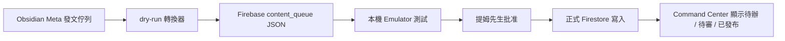

# Phase 1｜Ewalk.ai Command Center MVP

建立日期：2026-05-23  
負責角色：阿順  
最終決策者：提姆先生  
狀態：規格初版，等待 Firebase rules 測試與正式部署批准

## 目的

把 Ewalk.ai 的營運流程從 Obsidian 文件，逐步整理成可被系統讀取的資料流。第一個樣板用「韓食日常鍋物」的 Meta 發文佇列。

Phase 1 不做正式自動發文，只做：

- 內容佇列資料化
- 審核狀態資料化
- 發文紀錄資料化
- AI 員工分工資料化
- 後續 Command Center 可讀取的乾淨資料格式

## 目前已完成

- 韓食日常鍋物 `Meta自動發文佇列.md` 已可轉成 Firebase `content_queue` dry-run JSON。
- 轉換工具：`Ewalk.ai Brain/08_自動化/firebase/scripts/import-content-queue.mjs`
- 雙擊工具：`轉換韓食發文佇列.command`
- dry-run 輸出：`Ewalk.ai Brain/08_自動化/firebase/output/hansik-content-queue.dry-run.json`
- 只讀預覽工具：`Ewalk.ai Brain/08_自動化/firebase/scripts/build-command-center.mjs`
- 雙擊工具：`產生CommandCenter預覽.command`
- 預覽輸出：`Ewalk.ai Brain/08_自動化/firebase/output/command-center-preview.html`
- 成效追蹤 dry-run 工具：`Ewalk.ai Brain/08_自動化/firebase/scripts/build-performance-followups.mjs`
- 雙擊工具：`產生成效追蹤佇列.command`
- 成效追蹤輸出：`Ewalk.ai Brain/08_自動化/firebase/output/hansik-performance-followups.dry-run.json`
- 一鍵更新工具：`更新CommandCenter資料.command`
- 工作板：`Ewalk.ai Brain/08_自動化/firebase/docs/phase1-workboard.md`

## MVP 資料流

## 第一版 Command Center 需要顯示

### 今日總覽

- 待阿順檢查
- 待提姆先生批准
- 已批准待發布
- 發文失敗待人工處理
- 已發布但未回收成效

### 客戶內容佇列

每一列顯示：

- 客戶
- 平台
- 主題 / 貼文類型
- 狀態
- 排程時間
- 素材狀態
- 批准狀態
- Meta post id
- 下一步動作

### 風險控制

Command Center 第一版只允許：

- 讀取資料
- 顯示待辦
- 產生 dry-run
- 標記需要批准

不允許：

- 直接正式發文
- 修改廣告預算
- 寫入付款或 token
- 未批准開啟 AI 批量執行

## 狀態映射

| Obsidian 狀態 | Firebase status |
| --- | --- |
| 草稿 | `draft` |
| 待阿順檢查 | `pending_review` |
| 待提姆先生批准 | `pending_approval` |
| 已批准待發布 | `approved` |
| 已發布 | `published` |
| 發文失敗_待人工處理 | `failed` |

## 下一步

1. 本機 Emulator 穩定啟動後，把 dry-run JSON 寫入本機 `content_queue`。
2. 驗證 Firestore rules：未登入者不可讀寫，內部角色可讀，客戶只能看自己的資料。
3. 提姆先生批准後，部署 Firestore rules。
4. 正式 Firestore 第一批只寫入韓食日常鍋物 content queue。
5. 開始做 Command Center 只讀版畫面。

## 2026-05-23 只讀版預覽

目前已可從 `hansik-content-queue.dry-run.json` 產生只讀 HTML 預覽。這個頁面只用來看資料狀態，不連正式 Firebase，不會觸發發文。

目前顯示：

- 佇列總數
- 已批准待發布
- 已發布
- 待處理風險
- 每筆任務的狀態、排程、素材、批准人、Meta 連結與下一步
- 已發布貼文的 24 / 72 小時成效回收任務

## 需要提姆先生批准

- 是否允許把韓食日常鍋物 `content_queue` 第一批正式寫入 Firestore。
- 是否允許部署 Firestore rules 到正式 Firebase project。
- 是否允許後續建立 Command Center 只讀版頁面。
