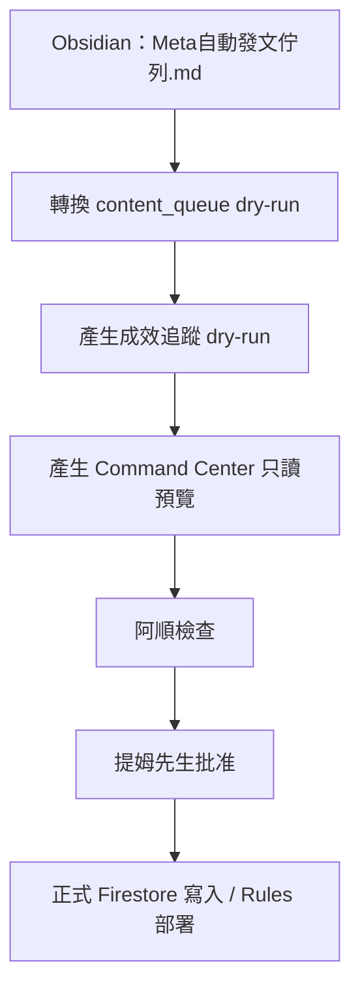

# Firebase Phase 1 工作板

建立日期：2026-05-23  
負責角色：阿順  
最終決策者：提姆先生  
樣板客戶：韓食日常鍋物  
狀態：安全 dry-run 工作流已建立，正式 Firebase 寫入與 Command Center Live Read 已完成

## 目前工作流



## 一鍵更新

雙擊根目錄：

```text
更新CommandCenter資料.command
```

這個指令會依序執行：

1. 讀取韓食日常鍋物 `Meta自動發文佇列.md`
2. 產生 `content_queue` dry-run JSON
3. 從已發布貼文產生 24 / 72 小時成效追蹤任務
4. 產生 Command Center 只讀 HTML 預覽

不會做：

- 不寫入正式 Firebase
- 不部署 rules
- 不呼叫 Meta API
- 不發文
- 不升級 Firebase Blaze

## 目前交付物

| 類型 | 路徑 | 用途 |
| --- | --- | --- |
| Content Queue | `Ewalk.ai Brain/08_自動化/firebase/output/hansik-content-queue.dry-run.json` | 韓食發文佇列資料化 |
| 成效追蹤 | `Ewalk.ai Brain/08_自動化/firebase/output/hansik-performance-followups.dry-run.json` | 24 / 72 小時回收任務 |
| Command Center | `Ewalk.ai Brain/08_自動化/firebase/output/command-center-preview.html` | 只讀管理頁預覽 |

## AI 員工分工

| 角色 | 負責內容 | 目前任務 |
| --- | --- | --- |
| 阿順 | 統籌、檢查、回報、批准關卡 | 維護工作流與 Command Center |
| 社群主編 | 發文主題、文案、CTA | 補齊下一輪韓食內容 |
| 設計企劃 | 視覺素材、GPT Image 2 指令 | 確認已批准待發布素材 |
| 數據分析師 | 24 / 72 小時成效回收 | 回收已發布 3 篇貼文成效 |
| 專案助理 | 佇列整理、欄位補齊 | 確認素材路徑與 Meta 連結完整 |

## 下一批任務

### A. 韓食內容佇列

- [x] 將已存在 4 筆 Meta 任務轉成 `content_queue` dry-run
- [x] 產生只讀 Command Center 預覽
- [ ] 補齊 2026-05-20 豬肉泡菜鍋內容草稿
- [ ] 補齊 2026-05-22 韓式牛肉拌飯內容草稿
- [ ] 補齊 2026-05-24 海鮮大醬湯內容草稿

### B. 成效追蹤

- [x] 將 3 篇已發布貼文拆成 6 筆 24 / 72 小時回收任務
- [ ] 數據分析師回收 Meta 成效數字
- [ ] 產出第一份韓食週成效摘要

### C. Firebase 上線前檢查

- [ ] Emulator 啟動穩定化
- [ ] Firestore rules 測試
- [ ] Storage 正式啟用決策：維持 Spark 或批准 Blaze
- [x] 正式寫入 `content_queue` 前交提姆先生批准
- [x] 重新執行正式 Firestore 寫入並完成回查驗證
- [x] 到 Firebase Console 抽查正式資料
- [x] 規劃 Command Center Web App 讀取正式 Firestore
- [x] 建立內部 Command Center App snapshot 版
- [x] 將 Command Center App 改成本機網址預覽模式
- [x] 接上 Firebase Auth + Firestore Live Read 前端安全切換
- [x] 建立 Firebase Web App config 本機設定工具
- [x] 建立 `users/{uid}` role 寫入工具
- [x] 建立使用者角色寫入紀錄模板
- [x] 建立 Firebase Rules 部署前權限稽核報告工具
- [x] Rules 靜態稽核 8/8 通過
- [x] 建立系統功能開關 dry-run
- [x] 將 rules 部署工具改為 Firestore / All 分流
- [x] 建立 Firebase Web App config 與本機設定
- [x] 建立取得 Firebase UID 的登入輔助頁
- [x] 取得提姆先生 Firebase Auth UID：`wGhBDfhD1RQB2AObEXNUTL5yhwR2`
- [x] 確認 client 端無法自建 owner role：正式 rules 回傳 `permission-denied`
- [x] 建立 `users/{uid}` 權限文件，role=`owner`，並完成 REST 回查
- [x] Command Center 正式讀取測試：初次被正式 rules 擋下
- [x] 提姆先生批准後只部署 Firestore rules
- [x] 部署後重新測試 Command Center Live Read
- [x] `tim.chen@ewalk.ai` 已通過 `role=owner` 權限檢查並讀回正式資料
- [x] 建立 Ewalk.ai 全客戶名冊 dry-run，確認韓食只是樣板客戶
- [x] Command Center 新增「客戶名冊」本機預覽區，顯示 15 位客戶
- [x] 提姆先生審核並批准客戶名冊，已正式匯入 `clients` collection
- [x] Command Center Live Read 回查 `clients` 15 筆

## 2026-05-23 正式部署紀錄

- 提姆先生已批准部署 Firestore rules。
- 本機 CLI 部署流程卡住，因此改用 Google OAuth + Firebase Rules REST API 備援部署。
- 已部署 release：`projects/ewalk-ai-system-prod/releases/cloud.firestore`
- 已部署 ruleset：`projects/ewalk-ai-system-prod/rulesets/aa7cd77c-9b09-43bb-ae24-62e9515736b5`
- Command Center 已重新測試成功：顯示「正式 Firestore 讀取模式」，`tim.chen@ewalk.ai` 通過 `role=owner`。
- 本次未部署 Storage rules、未啟用 Blaze、未呼叫 Meta API、未做任何發文或金流操作。

## 批准關卡

以下動作必須由提姆先生批准後才做：

- 部署 Firestore rules
- 部署 Storage rules
- 正式寫入 Firestore
- 寫入系統功能開關至正式 Firestore
- 正式呼叫 Meta API 發文
- 啟用 Firebase Blaze / billing
- 新增正式客戶入口

## 阿順目前建議

Phase 1 已完成第一批韓食資料正式寫入、Firestore rules 部署與 Command Center 正式讀取。下一步進入 Phase 2：把後台操作拆成只讀、待批准、正式執行三層，不碰發文、廣告、金流或 Blaze，除非提姆先生逐項批准。

2026-05-23 補充：Ewalk.ai 全客戶名冊已正式進入 Firestore，韓食日常鍋物從樣板升級為第一個可複製流程。下一步先補齊美業客戶的品牌資料與內容欄位，產生 dry-run 佇列後再交提姆先生審核。
