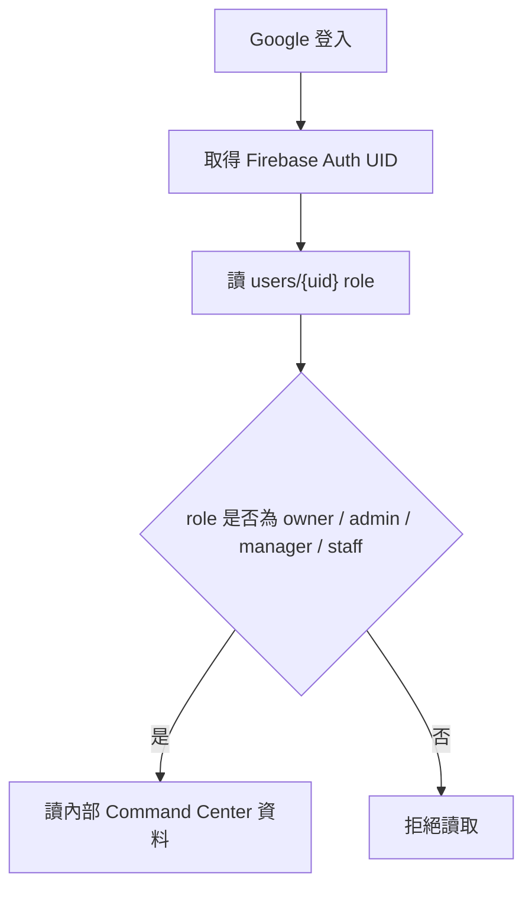
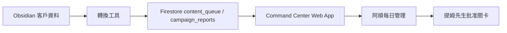

# Phase 2｜Command Center Web App 架構

建立日期：2026-05-23  
負責角色：阿順  
最終決策者：提姆先生  
狀態：內部只讀骨架已建立，正式 Firebase 即時讀取已通過

## 目標

把 Phase 1 的資料流變成 Ewalk.ai 內部可用的營運後台。

第一版不追求華麗功能，而是要讓阿順能每天管理：

- 客戶內容佇列
- 發文狀態
- 批准關卡
- 成效追蹤任務
- 權限風險

## 目前已完成

- 已建立內部 Command Center App：
  - `Ewalk.ai Brain/08_自動化/firebase/command-center-app/index.html`
  - `Ewalk.ai Brain/08_自動化/firebase/command-center-app/styles.css`
  - `Ewalk.ai Brain/08_自動化/firebase/command-center-app/app.js`
- 已建立 snapshot 資料生成器：
  - `Ewalk.ai Brain/08_自動化/firebase/scripts/build-command-center-app-data.mjs`
- 已建立雙擊工具：
  - `產生CommandCenterApp.command`
  - `取得FirebaseUID.command`
- 已建立正式 Firestore 讀取 adapter 預留：
  - `Ewalk.ai Brain/08_自動化/firebase/command-center-app/firestore-live-adapter.js`
  - `Ewalk.ai Brain/08_自動化/firebase/command-center-app/firebase-config.template.js`
- 已建立 users role 寫入工具：
  - `寫入Firebase使用者角色.command`
  - `Ewalk.ai Brain/08_自動化/firebase/scripts/prepare-user-role-write.mjs`
- 已建立 Firebase Auth 使用者頁快捷入口：
  - `開啟FirebaseAuthUsers.command`
- 已建立 Firebase Web App config 本機設定工具：
  - `建立CommandCenterFirebaseConfig.command`
- 已將 Command Center App 改成 localhost 本機預覽，預備支援 Firebase Auth 登入。
- 已建立部署 Firestore rules 的瀏覽器 OAuth 備援頁：
  - `Ewalk.ai Brain/08_自動化/firebase/command-center-app/deploy-firestore-rules.html`
- 已部署 Firestore rules 到正式專案，並驗證 Command Center 可用 `tim.chen@ewalk.ai` 讀正式資料。
- 已建立 Ewalk.ai 全客戶名冊 dry-run：
  - `Ewalk.ai Brain/08_自動化/firebase/scripts/build-client-registry.mjs`
  - `Ewalk.ai Brain/08_自動化/firebase/scripts/build-clients-firestore-import.mjs`
  - `Ewalk.ai Brain/08_自動化/firebase/output/client-registry.dry-run.json`
  - `Ewalk.ai Brain/08_自動化/firebase/output/clients-import.dry-run.json`
  - `Ewalk.ai Brain/08_自動化/firebase/command-center-app/data/client-registry.js`
  - `Ewalk.ai Brain/08_自動化/firebase/command-center-app/import-clients.html`
  - `Ewalk.ai Brain/08_自動化/firebase/docs/client-import-roadmap.md`
- Command Center 已新增「客戶名冊」區，顯示 15 位客戶；經提姆先生批准後，已正式寫入 Firestore 並回查 15 筆。

## 目前模式：Snapshot Read

資料來源：

```text
Ewalk.ai Brain/08_自動化/firebase/command-center-app/data/snapshot.js
```

用途：

- 驗證 UI
- 驗證欄位
- 驗證工作流
- 驗證提姆先生與阿順看板是否好用

限制：

- 不即時讀 Firestore
- 不登入
- 不開放客戶入口
- 不寫回資料

## 目前模式：Firebase Live Read

已完成：

1. 建立 Firebase Web App config
2. 建立提姆先生 `users/{uid}` 文件，role 設為 `owner`
3. 建立阿順 / AI 服務帳號 role 規則
4. Emulator 或正式 project 測試 Firestore rules
5. 提姆先生批准部署 rules
6. 啟用 `firestore-live-adapter.js`

Live Read 只做：

- Google 登入
- 讀取 `clients`
- 讀取 `content_queue`
- 讀取 `campaign_reports`
- 顯示內部看板

Live Read 不做：

- 發文
- 改預算
- 刪除資料
- 變更金流
- 寫入 token

## 權限路線



## 提姆先生 Owner Role 建立流程

目的：讓 Firestore rules 可以辨識提姆先生是 `owner`。

步驟：

1. 先到 Firebase Authentication 使用者頁：

```text
開啟FirebaseAuthUsers.command
```

2. 如果尚未存在，先執行 `取得FirebaseUID.command`，用 `tim.chen@ewalk.ai` 登入一次。
3. 第一次登入若尚未建立 role，畫面會顯示 `users/{uid}` 與 email，複製該 UID。
4. 執行：

```text
寫入Firebase使用者角色.command
```

5. 貼上 UID。
6. Email 預設使用 `tim.chen@ewalk.ai`。
7. 顯示名稱預設使用 `提姆先生`。
8. role 預設使用 `owner`。
9. 輸入 `WRITE` 後才正式寫入。

寫入後會建立：

- `users/{uid}`
- `audit_logs/user-role-bootstrap-*`

安全限制：

- `owner` 目前只允許 `tim.chen@ewalk.ai`
- 不發文
- 不部署 rules
- 不啟用 Blaze
- 不開放客戶入口

## Firebase Web App Config 建立流程

目的：讓本機 Command Center 可以登入 Google 並讀取正式 Firestore。

步驟：

1. 執行：

```text
建立CommandCenterFirebaseConfig.command
```

2. 在 Firebase Console 專案設定內建立或找到 Web App。
3. 將 `apiKey`、`appId`、`messagingSenderId`、`measurementId` 依序貼入。
4. 工具會產生本機檔案：

```text
Ewalk.ai Brain/08_自動化/firebase/command-center-app/firebase-config.local.js
```

這個檔案只留在本機，已列入 `.gitignore`。

完成後執行：

```text
取得FirebaseUID.command
產生CommandCenterApp.command
```

先用 `取得FirebaseUID.command` 取得 UID 並建立 owner role，再用 `http://localhost:17990/` 開啟 Command Center，按「登入讀正式資料」。

## 2026-05-23 Live Read 驗收

- Firestore rules release：`projects/ewalk-ai-system-prod/releases/cloud.firestore`
- Firestore ruleset：`projects/ewalk-ai-system-prod/rulesets/aa7cd77c-9b09-43bb-ae24-62e9515736b5`
- 驗證帳號：`tim.chen@ewalk.ai`
- 驗證 role：`owner`
- 驗證結果：Command Center 顯示「正式 Firestore 讀取模式」，並讀回韓食日常鍋物 `content_queue` 與 `campaign_reports`。
- 本次沒有啟用 Hosting、Storage、Blaze、Meta 發文或任何金流操作。

## 2026-05-23 客戶名冊樣板擴充

韓食日常鍋物是第一個標準樣板，現在已把樣板抽成 Ewalk.ai 全客戶名冊流程。

目前狀態：

- 掃描 `01_客戶`，共找到 15 位客戶。
- Command Center 顯示客戶數、客戶名稱、產業、資料狀態與下一步。
- 目前只有韓食具備 `Meta自動發文佇列.md`，可作為內容佇列樣板。
- TheVision、TG、STAR Color、STAR SPA、OC、KaDou 有內容或品牌資料，可進入「客戶基本資料＋內容欄位補齊」。
- 提姆先生已批准正式匯入全客戶名冊。
- Command Center 使用 `tim.chen@ewalk.ai` `role=owner` 回查 `clients` 15 筆。
- 接下來只整理客戶基本資料與內容欄位，不自動發文、不改預算。

## 2026-05-23 客戶名冊正式匯入驗收

- 驗證帳號：`tim.chen@ewalk.ai`
- 驗證 role：`owner`
- Firestore collection：`clients`
- 回查筆數：15
- Command Center 顯示：「正式 Firestore 讀取模式」
- 本次未呼叫 Meta API、未發文、未改廣告預算、未啟用 Blaze / billing。

## 2026-05-23 客戶資料補齊盤點

- 已建立補齊盤點：`Ewalk.ai Brain/08_自動化/firebase/docs/client-data-readiness-report.md`
- 已建立 SOP：`Ewalk.ai Brain/13_SOP流程/客戶資料補齊到Command Center SOP.md`
- 第一批建議導入美業客戶：The Vision、TG、STAR Color、STAR SPA、OC、KaDou。
- 每位客戶都先補資料與 dry-run，再交提姆先生批准正式進佇列。

## 資料流



## 驗收標準

- 提姆先生可打開內部 App 看見韓食日常鍋物資料
- 總佇列、已發布、已批准、成效待回收數字正確
- 內容佇列可依狀態篩選
- 成效追蹤任務可讀
- 權限控管提醒固定存在
- 沒有發文或付費操作入口

## 下一步建議

先不要急著部署 Hosting。下一步先把 Command Center 拆成「只讀營運看板」、「待批准佇列」、「正式執行工具」三層，讓提姆先生可以清楚看到哪些工作只是內部管理、哪些會對外發布。

目前部署策略：

- 優先只部署 Firestore rules；indexes 只有遇到查詢需求時才補部署
- Storage rules 暫不部署，除非 Storage bucket / Blaze 決策完成
- Command Center 只讀，不提供發文、預算、金流操作
