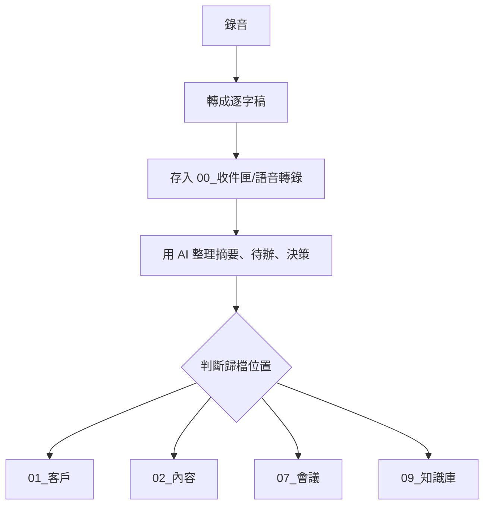

# 語音錄音整理到 Obsidian

這套流程用來把口述想法、客戶會議、靈感錄音整理成 Obsidian 筆記。

## 目標

把錄音變成可搜尋、可行動、可歸檔的 Markdown 筆記。

## 建議流程



## 每次錄音後要產出的內容

- 標題
- 日期
- 來源：錄音 / 會議 / 口述 / 靈感
- 逐字稿
- 摘要
- 重點
- 待辦
- 決策
- 可歸檔位置
- 相關客戶或專案

## 命名規則

```text
YYYY-MM-DD - 語音 - 主題.md
```

範例：

```text
2026-04-27 - 語音 - TheVision五月檔期討論.md
```

## 資料夾規則

先進：

```text
00_收件匣/語音轉錄
```

整理後再移到：

- 客戶相關：`01_客戶/客戶名稱/`
- 內容企劃：`02_內容/`
- 會議紀錄：`07_會議/`
- 方法論與洞察：`09_知識庫/`

## 推薦使用方式

1. 用 iPhone / iPad 錄音或語音輸入
2. 將錄音轉成文字
3. 用 `整理提示詞.md` 請 AI 整理
4. 套用 `模板/語音筆記模板.md`
5. 放進 `00_收件匣/語音轉錄`
6. 每天或每週整理歸檔

