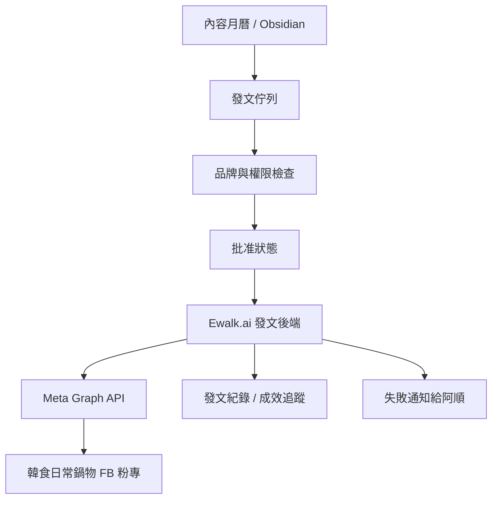

# Meta 粉專全自動發文串接 SOP

建立日期：2026-05-15
狀態：韓食日常鍋物 FB / IG 自動發布皆已驗證，可套用到其他客戶
樣板客戶：韓食日常鍋物
主管：阿順
最終決策者：提姆先生

## 目的

建立 Ewalk.ai 的 Meta 粉專自動發文流程，讓公司能從內容規劃、文案、素材、審核、排程、正式發文、發文紀錄到成效追蹤建檔，逐步走向自動化。

韓食日常鍋物作為第一個樣板，原因是粉專與 IG 由 Ewalk.ai 可控管理，權限、品牌資料與素材比較容易整理，適合做第一版可控試點。2026-06-02 已完成正式 Meta Business System User token、Page token 驗證、Facebook 圖片貼文發布、排程回寫與成效追蹤建檔。2026-06-03 已完成 Instagram Graph API 圖片貼文正式發布、IG Media ID 回寫與成效追蹤建檔。

後續客戶導入請同時使用：

- `Ewalk.ai Brain/08_自動化/skills/ops-meta-social-auto-publish/SKILL.md`
- `Ewalk.ai Brain/08_自動化/skills/ops-meta-page-auto-publish/SKILL.md`
- `Ewalk.ai Brain/13_SOP流程/Meta粉專全自動發文客戶啟用清單.md`
- `Ewalk.ai Brain/11_Prompt資料庫/Meta粉專自動發文Prompt.md`

## 重要原則

- 全自動發文不是第一天就直接放行。
- 先完成 Meta 開發者帳號、粉專權限、API 權限、發文測試與紀錄機制。
- Graph API Explorer / 使用者登入取得的測試 token 只能用於半自動測試，不能作為正式全自動發文憑證。
- 正式全自動發文必須改用 Meta Business System User token 或後端 OAuth 長期憑證流程。
- Access token 不可放在 Obsidian、前端、公開 repo 或聊天紀錄。
- 發文前要有內容規則、品牌規範、禁止項目與失敗回滾流程。
- 廣告預算、付費推廣、政治敏感、醫療宣稱、優惠承諾等內容，仍需提姆先生批准。

## Meta 權限與工具

### 需要準備

- Meta Developer Account
- Meta Business Suite / Business Portfolio
- Facebook Page 管理員權限
- Meta App
- 後端服務，用來安全保存 token 與呼叫 Graph API
- 發文佇列與紀錄資料庫

### Ewalk.ai 第一版本機工具

韓食日常鍋物第一版先使用 Vault 內工具：

- `腳本/meta-facebook/check-page.mjs`：用 Page access token 檢查粉專連線。
- `腳本/meta-facebook/publish-page-post.mjs`：發布文字貼文。預設 dry-run，不會真的發文。
- `腳本/meta-facebook/.env.local`：只放本機 token，不進 Git，不進 Obsidian 文件。

正式發文條件：

1. 貼文在客戶資料夾佇列中。
2. 阿順完成品牌與風險檢查。
3. 提姆先生批准。
4. 發文工具帶入 `--publish`、`--approved-by "提姆先生"`、`--confirm-page-id`。
5. 發文後回寫 Meta Post ID。

### 憑證分級

| 階段 | 憑證類型 | 可做 | 不可做 |
| --- | --- | --- | --- |
| Stage 1 半自動測試 | Graph API Explorer / 使用者登入 token | 測試粉專連線、測試發文工具、人工補 token 後發布 | 長期自動排程、無人值守發文 |
| Stage 2 正式自動化 | Meta Business System User token 或後端 OAuth 長期憑證 | 穩定排程發文、成效回收、錯誤通知 | 未經批准調整廣告預算或發布高風險內容 |

韓食日常鍋物目前狀態：

```text
Stage 2 / 3 核心鏈路已完成：
內容與 GPT Image 2 視覺自動化已建立；
Meta System User token 已完成；
Page token 已驗證；
已成功發布 Facebook 正式圖片貼文；
IG token、ig_user_id、公開圖片 URL 流程已完成；
已成功發布 Instagram 正式圖片貼文；
排程、佇列與成效追蹤總表可分平台回寫。
```

### Meta 權限頁注意事項

Meta Developer 的「權限和功能」頁可能有上下兩個搜尋區塊。

韓食日常鍋物第一次測試建立了 `企業商家` 類型 App，並加入「商家專用 Facebook 登入」。實測發現：

- 上方搜尋框可能只找得到非存取權驗證項目。
- `pages_manage_posts`、`pages_read_engagement`、`pages_show_list` 位於下方「需存取權驗證」表格。
- 找不到權限時，先確認是不是搜尋錯區塊，不要立刻重建 App。

若下方表格可看到三個必要權限且狀態為 Standard access / 不需要應用程式審查，第一階段可先用開發模式與 App 管理員身份做測試。

### 常見需要權限

實作前要以 Meta Developer Dashboard 當下顯示為準。

| 權限 | 用途 |
| --- | --- |
| `pages_show_list` | 列出可管理粉專，取得粉專選擇權 |
| `pages_read_engagement` | 讀取粉專互動與基本成效 |
| `pages_manage_posts` | 發布、管理粉專貼文 |
| `pages_manage_metadata` | 管理粉專 metadata、webhooks 等情境可能需要 |
| `read_insights` | 若要讀取更完整洞察數據時使用 |
| `business_management` | 若要在 Business Portfolio 層級管理資產時使用 |

### `me/accounts` 看不到粉專時

韓食日常鍋物第一次實測遇到：

- Business Suite 已確認粉專在 Business Portfolio 內。
- 提姆先生對粉專有完整控制權。
- App 已在同一個 Business Portfolio 內。
- Facebook 企業整合工具內，App 已取得 Pages 相關能力。
- 但 `me/accounts?fields=id,name&limit=100` 沒有回傳該粉專。

處理順序：

1. 確認 Facebook 企業整合工具內，該 App 的 `pages_manage_posts`、`pages_read_engagement`、`pages_show_list` 能力都有開。
2. 補 `business_management` 權限，重新產生短期測試 token。
3. 再測 `me/accounts?fields=id,name&limit=100`。
4. 若仍未回傳，改測 Business 資產路徑：`me/businesses?fields=id,name`、`{business-id}/owned_pages?fields=id,name`、`me/assigned_pages?fields=id,name,tasks`。
5. 若 Business 資產路徑能看到粉專，正式系統就要走 Business Login / 後端 OAuth 流程，不只依賴 Graph API Explorer。

韓食日常鍋物實測結論：

- 補 `business_management` 後，`me/accounts?fields=id,name&limit=100` 已成功回傳粉專。
- 回傳的 Page ID 與 Business Suite 顯示的 `1082884688247950` 一致。
- 後續 Ewalk.ai 做 Business Portfolio 內粉專自動化時，`business_management` 要列入測試權限。

安全規則：

- 任何 Access Token、Page Access Token、App Secret 都不得寫入 Obsidian。
- 若測試過程 token 曾出現在畫面或工具輸出，該 token 只當臨時測試使用，不進正式系統。

若要同步 IG：

| 權限 | 用途 |
| --- | --- |
| `instagram_basic` | 讀取 IG 商業 / 創作者帳號基本資料 |
| `instagram_content_publish` | 發布 IG 內容 |

IG 同步發布不是直接沿用 Facebook `/{page-id}/photos`。Instagram feed 圖片發布需先建立 media container，再呼叫 `media_publish`。圖片需提供 Meta 可讀取的公開 URL，不能只用本機檔案路徑。

FB / IG 動態共用圖建議統一：

```text
1080 x 1350
比例：4:5
格式：內部可留 PNG，IG API 發布建議準備 JPEG 與公開圖片 URL
```

導入 IG 同步前需確認：

- IG 是專業 / 商業帳號
- IG 已連結對應 Facebook Page
- 已取得 `ig_user_id`
- App / System User 具備 IG 發布權限
- 成效追蹤總表能分平台記錄 FB Post ID 與 IG Media ID

韓食日常鍋物 2026-06-03 實測結論：

- IG 帳號 `hansik.hotpot` 已由 API 偵測。
- `ig_user_id` 已取得。
- 1080x1350 JPEG 已透過公開 Production URL 提供給 Meta。
- `media container` 與 `media_publish` 流程已完成。
- 正式 IG Media ID 已回寫佇列與成效追蹤總表。

## 發文 API 基本方向

Facebook Page 發文通常走 Graph API：

```text
POST /{page-id}/feed
```

常見參數：

- `message`：貼文文字
- `link`：連結貼文
- `published`：是否立即發布
- `scheduled_publish_time`：排程發布時間
- `access_token`：Page access token

圖片貼文通常走：

```text
POST /{page-id}/photos
```

影片、Reels、限時動態需另外確認當下 Graph API 支援方式與權限。

## 三階段導入

### 第 1 階段：半自動驗證

目的：

- 確認權限、token、API、粉專都能正常運作。
- 每篇貼文仍由提姆先生或阿順確認後發出。

流程：

1. 社群主編產出貼文文案。
2. 設計企劃產出素材或素材需求；若為韓食日常鍋物，最終社群視覺一律交由 GPT Image 2 製作，不直接使用產品原圖當最終貼文圖。
3. 阿順檢查品牌語氣、禁用語、CTA。
4. 提姆先生批准。
5. 系統呼叫 Graph API 發文。
6. 系統記錄 post id、發布時間、內容、素材、狀態。
7. 成效追蹤員建立追蹤紀錄，標記 1 小時、24 小時、72 小時與 7 天追蹤節點。

### 第 2 階段：自動排程

目的：

- 已批准的內容自動排程，不需要手動進 Meta Business Suite。
- 前提是已完成正式 System User token 或後端 OAuth 長期憑證，不可使用 Graph API Explorer 測試 token。

流程：

1. 每週內容表標註 `狀態：已批准排程`。
2. 系統每天檢查待發布貼文。
3. 到時間後自動發文。
4. 發文完成後回寫紀錄。
5. 成效追蹤員建立追蹤紀錄，先做歸檔，不要求每日回報。
6. 發文失敗時通知阿順，改為待人工處理。

### 第 3 階段：規則內全自動

目的：

- 對低風險、固定格式、已批准策略的內容自動產出與發布。

允許範圍：

- 日常菜色介紹
- 營業時間提醒
- 店內氛圍
- 顧客評論再利用，但不得捏造
- 固定活動提醒

不允許自動發布：

- 優惠條件不清楚
- 價格或期限未確認
- 客訴、爭議、道歉聲明
- 需要法律、財務或品牌決策的內容
- 廣告預算或付費推廣設定

## 系統架構



## 發文資料格式

建議每篇貼文用固定欄位管理：

```yaml
客戶: 韓食日常鍋物
平台: Facebook / Instagram
貼文類型: 菜色介紹
狀態: 已批准排程
發布時間: 2026-05-20 18:30
文案:
素材:
IG公開圖片URL:
連結:
CTA:
審核人: 提姆先生
Meta Page ID:
Facebook Post ID:
IG User ID:
IG Media ID:
```

## 失敗處理

發文失敗時：

1. 不重複無限重試。
2. 記錄錯誤碼與錯誤訊息。
3. 標註為 `發文失敗_待人工處理`。
4. 通知阿順。
5. 阿順判斷是 token、權限、素材格式、排程時間還是 Meta API 問題。

## 成效回收

建議發文後自動追蹤：

- 發布後 1 小時：確認貼文存在
- 發布後 24 小時：抓互動數據
- 發布後 72 小時：抓第二次互動數據
- 每週五：整理內容表現

## 安全規則

- token 只放在後端環境變數或安全密鑰管理。
- 不把 token 寫進 Obsidian。
- 不把 token 傳給前端。
- 不把 token 貼到聊天紀錄。
- 每次發文要有唯一任務 ID，避免重複發文。
- 發文前檢查是否已發布過相同任務。

## 上線前檢查清單

- [x] Meta Developer Account 已建立
- [x] Meta App 已建立，且權限頁下方表格可看到 Pages API 發文權限
- [x] 韓食日常鍋物粉專確認由 Ewalk.ai 管理
- [x] App 與粉專 / Business Portfolio 關聯完成
- [x] 所需 Page 權限已能測試
- [x] Page access token 能安全取得
- [x] 本機 dry-run 發文工具已建立
- [x] 測試貼文能發布到測試粉專
- [x] 發文紀錄能回寫
- [x] Instagram 商業帳號、粉專連結與 IG User ID 已驗證
- [x] IG 公開圖片 URL 流程已建立
- [x] IG dry-run 與正式發布已完成
- [ ] 發文失敗能通知阿順
- [ ] 提姆先生批准進入 FB / IG 全自動同步排程

## 資料來源

- Meta Pages API Posts：`https://developers.facebook.com/docs/pages-api/posts/`
- Meta Page Feed Graph API：`https://developers.facebook.com/docs/graph-api/reference/page/feed/`
- Meta Access Tokens：`https://developers.facebook.com/docs/facebook-login/guides/access-tokens/`
- Meta App Review：`https://developers.facebook.com/docs/app-review/`
- Meta Instagram Content Publishing：`https://developers.facebook.com/docs/instagram-platform/content-publishing/`
